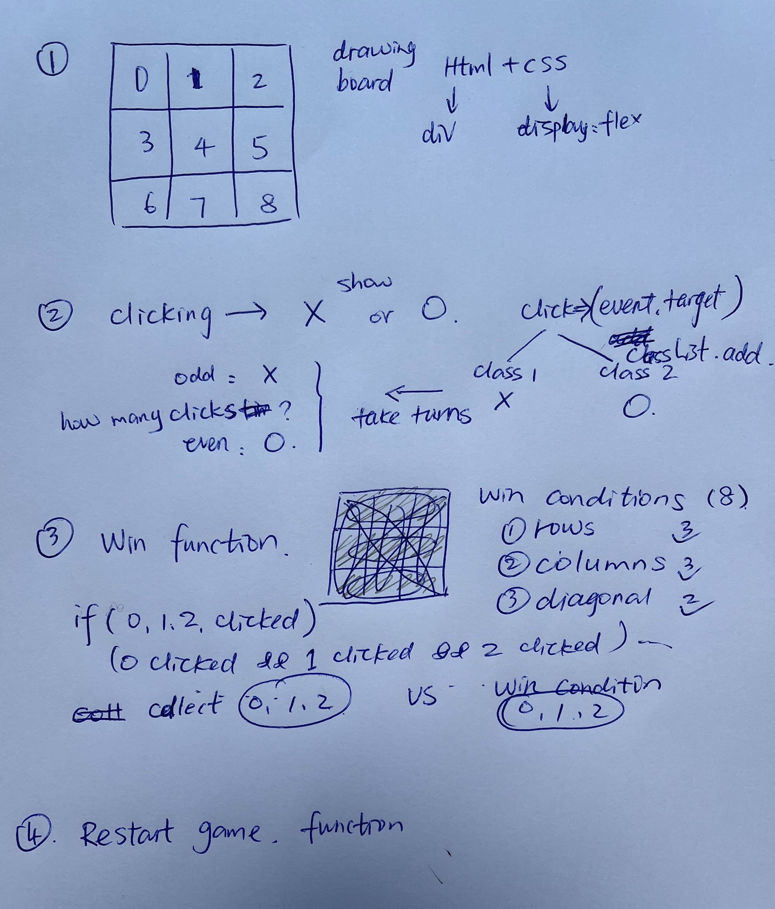

# Tic Tac Toe

##  :computer: [Click here](https://goodhua2018.github.io/tic-tac-toe/) to see my live project!

## :page_facing_up: About
- Tic-Tac-Toe is a simple and fun game for 2 players, X and O;
- It is played on a 3x3 grid. Each player's goal is to make 3 in a row;
- X starts first and players take turns placing their Mark, X or O;
- Players who make 3 of their own mark in a row vertically, horizontally, or diagonally wins the game.

## :pencil2: Planning & Problem Solving
- 9 boxes to make a board -- html + css flex display
- click one of the boxes, background-img change to X or O -- add click event
- switch trun -- even number/odd number
- how to judge a win -- function 
- how to reset the game -- function 
- plan

## :rocket: Cool tech
- Javascript
- HTML
- CSS

## :scream: Bugs to fix :poop:
- if a box is taken by X or O, they can be changed by another click. ---fixed
- when a player wins, the other empty box still can be clicked and filled. --- fixed
- if the last step, the last box is filled, if a player wins, still show "a draw". --- fixed

## :sob: Lessons learnt
when a box is clicked, the id pushed into clicked array to store. I learnt that they are strings not numbers;
we cannot compare two arrays even they have same items inside;

## :white_check_mark: Future features
Now, player 1 is always X and player 2 is always O. will make an option which player get the first step, which image the player would like to use. For example, player 1 can choose to be O, not always X; or player 2 can be the first step. 
Add background music
